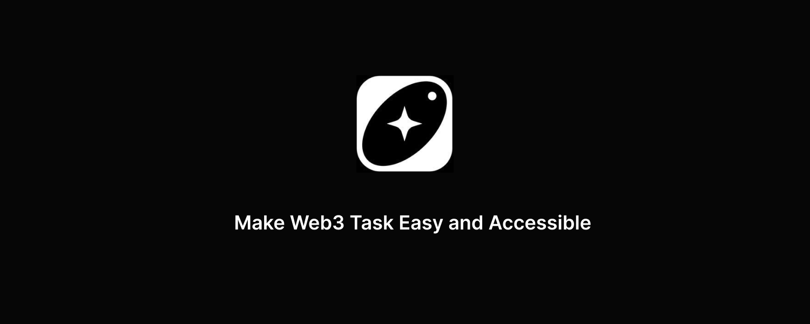
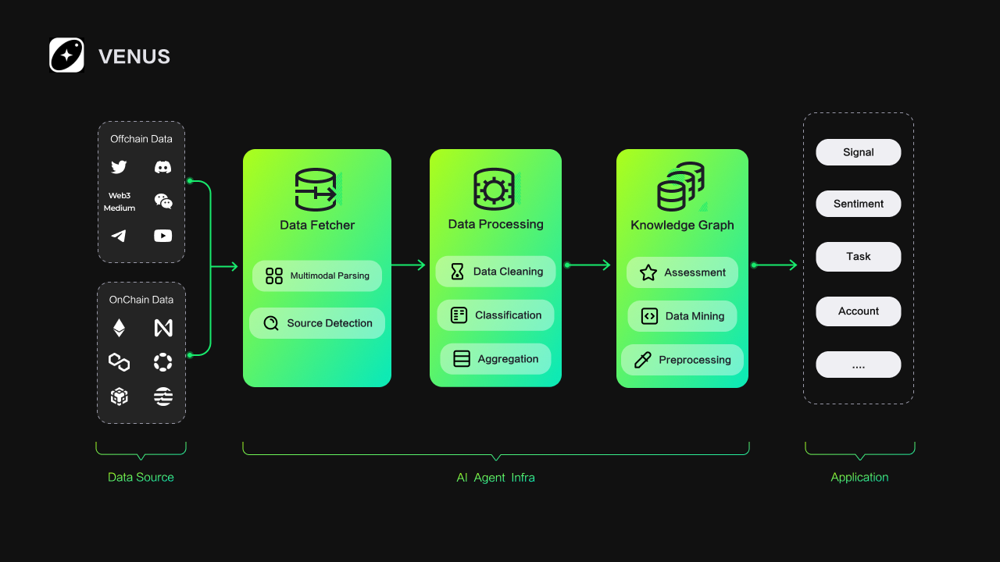

# VENUS 🤖

📖 [Documentation](https://venusweb3.gitbook.io/venus/)

## 🚩 Overview

  

## ✨ Features

- 🤖Decentralized Intelligent Tasks

Leverage the high performance and low-cost features of the Ancient8 blockchain to ensure secure and efficient task execution.

- 🔐Trusted Execution Environment

Built on Phala Network’s TEE to guarantee the privacy and trustworthiness of user data and task execution.

- 💻No-Code and Visual Interface

Allows users to configure task logic via a drag-and-drop interface, enabling the creation of powerful AI Agents without any programming knowledge.

- 👭Scalability and Collaboration

Establish an open ecosystem where users and developers can collaboratively build and share automation solutions.

## 🎯 Use Cases

  

- 🤖 Chatbots
- 🧠 Trading Bot
- 🕵️ Autonomous Agents
- 📈 Business Process Handling
- 🎮 Video Game NPCs

## 🚀 Quick Start

Coming soon

## Community & contact

- [X](https://x.com/VenusWeb3). Best for: sharing your applications and hanging out with the community.
